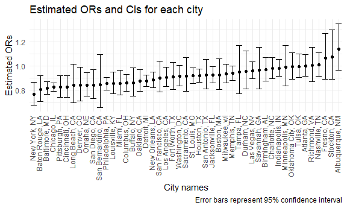
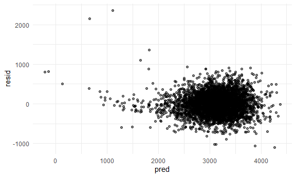

p8105_hw6_js6177
================
Jiayi Shi
2022-11-20

## Problem 2

The code below imports, cleans, and generally wrangles the data for
analysis. Omit cities Dallas, TX; Phoenix, AZ; Kansas City, MO – these
don’t report victim race. Also omit Tulsa, AL – this is a data entry
mistake; `victim_age` unknown.

``` r
homicide_data = read_csv("data/homicide-data.csv") %>% 
  mutate(
    city_state = str_c(city, state, sep = ", "),
    resolved = as.numeric(disposition == "Closed by arrest")
         ) %>% 
  filter(!(city_state %in% c("Dallas, TX", "Phoenix, AZ", "Kansas City, MO","Tulsa, AL")), victim_race %in% c("White", "Black"), victim_age != "Unknown") %>% 
  mutate(
    victim_age = as.numeric(victim_age),
    victim_race = fct_relevel(victim_race, "White")
    )
```

    ## Rows: 52179 Columns: 12
    ## ── Column specification ────────────────────────────────────────────────────────
    ## Delimiter: ","
    ## chr (9): uid, victim_last, victim_first, victim_race, victim_age, victim_sex...
    ## dbl (3): reported_date, lat, lon
    ## 
    ## ℹ Use `spec()` to retrieve the full column specification for this data.
    ## ℹ Specify the column types or set `show_col_types = FALSE` to quiet this message.

For the city of Baltimore, MD, use the glm function to fit a logistic
regression with resolved vs unresolved as the outcome and victim age,
sex and race as predictors.

``` r
fit_logistic = 
  homicide_data %>%
  filter(city == "Baltimore") %>% 
  dplyr::select(city_state, resolved, victim_age, victim_race, victim_sex) %>%
  glm(resolved ~ victim_age + victim_race + victim_sex, data = ., family = binomial()) 
```

Obtain the estimate and confidence interval of the adjusted odds ratio
for solving homicides comparing male victims to female victims keeping
all other variables fixed.

``` r
# estimate
fit_logistic %>% 
  broom::tidy() %>% 
  mutate(estimate = exp(estimate)) %>% 
  pull(estimate) %>% .[4]
```

    ## [1] 0.4255117

``` r
# confidence interval ci
lower_bound = exp(confint(fit_logistic, parm = "victim_sexMale"))[[1]]
```

    ## Waiting for profiling to be done...

``` r
upper_bound = exp(confint(fit_logistic, parm = "victim_sexMale"))[[2]]
```

    ## Waiting for profiling to be done...

``` r
ci = paste0("(", lower_bound, ",", upper_bound, ")")
```

``` r
odds_ratio = function(model){
  tibble(
    adjusted_or = model %>% 
      broom::tidy() %>% 
      mutate(estimate = exp(estimate)) %>% 
      pull(estimate) %>% .[4],
    lower_bound = exp(confint(model, parm = "victim_sexMale"))[[1]],
    upper_bound = exp(confint(model, parm = "victim_sexMale"))[[2]],
   )
}
```

``` r
plot_df = homicide_data %>% 
  dplyr::select(city_state, resolved, victim_age, victim_race, victim_sex) %>% 
  nest(df = resolved:victim_sex) %>% 
  mutate(
    models = map(df, ~glm(resolved ~ victim_age + victim_race + victim_sex, data = .x)),
    results = map(models, odds_ratio)) %>% 
  dplyr::select(-df, -models) %>% 
  unnest(results)
```

Plot

``` r
plot_df %>% 
  # Organize cities according to the estimated OR.
  mutate(city_state = fct_reorder(city_state, adjusted_or)) %>% 
  
  ggplot(aes(x = city_state, y = adjusted_or))+
  geom_point()+
  geom_errorbar(aes(ymin = lower_bound, ymax = upper_bound))+
  labs(title = "Estimated ORs and CIs for each city", 
       y = "Estimated ORs", 
       x = "City names", 
       caption = "Error bars represent 95% confidence interval") +
  theme(axis.text.x = element_text(angle = 90, vjust = 0.2, hjust = 1))
```



## Problem 3

Load the data, convert numeric variables `babysex`, `frace`, `malform`,
`mrace` to factors and omit missing values.

``` r
birthwt = read_csv("data/birthweight.csv")
```

    ## Rows: 4342 Columns: 20
    ## ── Column specification ────────────────────────────────────────────────────────
    ## Delimiter: ","
    ## dbl (20): babysex, bhead, blength, bwt, delwt, fincome, frace, gaweeks, malf...
    ## 
    ## ℹ Use `spec()` to retrieve the full column specification for this data.
    ## ℹ Specify the column types or set `show_col_types = FALSE` to quiet this message.

``` r
str(birthwt)
```

    ## spec_tbl_df [4,342 × 20] (S3: spec_tbl_df/tbl_df/tbl/data.frame)
    ##  $ babysex : num [1:4342] 2 1 2 1 2 1 2 2 1 1 ...
    ##  $ bhead   : num [1:4342] 34 34 36 34 34 33 33 33 36 33 ...
    ##  $ blength : num [1:4342] 51 48 50 52 52 52 46 49 52 50 ...
    ##  $ bwt     : num [1:4342] 3629 3062 3345 3062 3374 ...
    ##  $ delwt   : num [1:4342] 177 156 148 157 156 129 126 140 146 169 ...
    ##  $ fincome : num [1:4342] 35 65 85 55 5 55 96 5 85 75 ...
    ##  $ frace   : num [1:4342] 1 2 1 1 1 1 2 1 1 2 ...
    ##  $ gaweeks : num [1:4342] 39.9 25.9 39.9 40 41.6 ...
    ##  $ malform : num [1:4342] 0 0 0 0 0 0 0 0 0 0 ...
    ##  $ menarche: num [1:4342] 13 14 12 14 13 12 14 12 11 12 ...
    ##  $ mheight : num [1:4342] 63 65 64 64 66 66 72 62 61 64 ...
    ##  $ momage  : num [1:4342] 36 25 29 18 20 23 29 19 13 19 ...
    ##  $ mrace   : num [1:4342] 1 2 1 1 1 1 2 1 1 2 ...
    ##  $ parity  : num [1:4342] 3 0 0 0 0 0 0 0 0 0 ...
    ##  $ pnumlbw : num [1:4342] 0 0 0 0 0 0 0 0 0 0 ...
    ##  $ pnumsga : num [1:4342] 0 0 0 0 0 0 0 0 0 0 ...
    ##  $ ppbmi   : num [1:4342] 26.3 21.3 23.6 21.8 21 ...
    ##  $ ppwt    : num [1:4342] 148 128 137 127 130 115 105 119 105 145 ...
    ##  $ smoken  : num [1:4342] 0 0 1 10 1 0 0 0 0 4 ...
    ##  $ wtgain  : num [1:4342] 29 28 11 30 26 14 21 21 41 24 ...
    ##  - attr(*, "spec")=
    ##   .. cols(
    ##   ..   babysex = col_double(),
    ##   ..   bhead = col_double(),
    ##   ..   blength = col_double(),
    ##   ..   bwt = col_double(),
    ##   ..   delwt = col_double(),
    ##   ..   fincome = col_double(),
    ##   ..   frace = col_double(),
    ##   ..   gaweeks = col_double(),
    ##   ..   malform = col_double(),
    ##   ..   menarche = col_double(),
    ##   ..   mheight = col_double(),
    ##   ..   momage = col_double(),
    ##   ..   mrace = col_double(),
    ##   ..   parity = col_double(),
    ##   ..   pnumlbw = col_double(),
    ##   ..   pnumsga = col_double(),
    ##   ..   ppbmi = col_double(),
    ##   ..   ppwt = col_double(),
    ##   ..   smoken = col_double(),
    ##   ..   wtgain = col_double()
    ##   .. )
    ##  - attr(*, "problems")=<externalptr>

``` r
birthwt = birthwt %>% 
  mutate(across(c(babysex, frace, malform, mrace), as.factor)) %>% 
  select(bwt, everything()) 

#First ensure that the missing values have been removed from the data
birthwt = na.omit(birthwt)

#sapply(birthwt, function(x) sum(is.na(x)))# no missing values
```

I build my model `both` using stepwise regression.

``` r
null = lm(bwt ~ 1, data = birthwt)
full = lm(bwt ~ ., data = birthwt)
both = step(null, direction='both', scope=formula(full), trace=0)
both$coefficients
```

    ##   (Intercept)         bhead       blength        mrace2        mrace3 
    ## -5683.3155772   130.8391142    74.9782841  -138.8296943   -76.3487944 
    ##        mrace4         delwt       gaweeks        smoken         ppbmi 
    ##  -101.7777320     4.1085711    11.5806032    -4.8442918    -9.2218922 
    ##      babysex2        parity          ppwt       fincome 
    ##    28.5570040    95.8951528    -1.0679341     0.3229627

Plot of model residuals against fitted values:

``` r
birthwt %>% 
  add_predictions(both) %>% 
  add_residuals(both) %>% 
  ggplot(aes(x = pred, y = resid)) +
  geom_point(alpha = .5)
```



I then compare my model to two others. I make a violin plot to get a
sense of variance in prediction error to show prediction error
distributions across methods. My model is a clear winner.

``` r
cv_df = 
  crossv_mc(birthwt, 100) %>% 
  mutate(
    my_mod  = map(train, ~both, data = .x),
    mod_1  = map(train, ~lm(bwt ~ blength + gaweeks, data = .x)),
    mod_2  = map(train, ~lm(bwt ~ bhead*blength*babysex, data = .x))) %>% 
  mutate(
    rmse_mymod = map2_dbl(my_mod, test, ~rmse(model = .x, data = .y)),
    rmse_mod1 = map2_dbl(mod_1, test, ~rmse(model = .x, data = .y)),
    rmse_mod2 = map2_dbl(mod_2, test, ~rmse(model = .x, data = .y)))

cv_df %>% 
  select(starts_with("rmse")) %>% 
  pivot_longer(
    everything(),
    names_to = "model", 
    values_to = "rmse",
    names_prefix = "rmse_") %>% 
  mutate(model = fct_inorder(model)) %>% 
  ggplot(aes(x = model, y = rmse)) + geom_violin()
```


